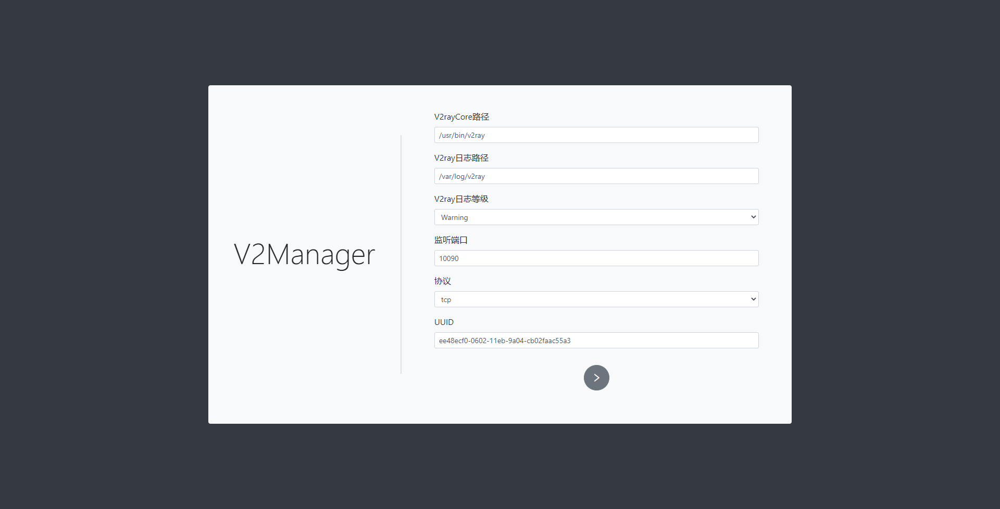

# Vue

由于最近在学习Vue，所以就把V2Manger移植到了Vue上~~（其实相当于重写了一个~~），姑且界面好看了点。。。

## 环境依赖

* NodeJS
* Vue
* Express
* Typescript
* Typeorm
* SQLite3
* curl
* wget
* bash
* v2ray

## 安装

### 环境安装

```text
$ sudo apt install sqlite3 wget curl bash -y
```

### NodeJS安装

```text
$ wget https://nodejs.org/dist/v12.19.0/node-v12.19.0-linux-x64.tar.xz
$ xz -d node-v12.19.0-linux-x64.tar.xz
$ tar xvf node-v12.19.0-linux-x64.tar

$ mv node-v12.19.0-linux-x64 /usr/node
$ sudo ln -s /usr/node/bin/node /usr/local/bin/node
$ sudo ln -s /usr/node/bin/npm /usr/local/bin/npm
```

### 安装V2Manager

#### 下载V2Manger

从[Github](https://github.com/Dreammer12138/V2Manager)上下载最新的发行包，解压。

#### 安装V2ray

```text
# 进入V2Manager项目下
$ cd V2Manager

$ sudo chmod a+x go.sh
$ sudo bash go.sh
```

等待其安装完成即可。由于官方提供的资源均托管于Github，有些地区下载速度可能会比较慢，请耐心等待。

 如果有其他渠道提供的V2ray压缩包，请把压缩包移动到`/tmp/v2ray`路径下，并将go.sh文件中的以下代码删除。

```text
downloadV2Ray(){
    # 从这里开始
    rm -rf /tmp/v2ray
    mkdir -p /tmp/v2ray
    DOWNLOAD_LINK="https://github.com/v2ray/v2ray-core/releases/download/${NEW_VER}/v2ray-linux-${VDIS}.zip"
    colorEcho ${BLUE} "Downloading V2Ray: ${DOWNLOAD_LINK}"
    curl ${PROXY} -L -H "Cache-Control: no-cache" -o ${ZIPFILE} ${DOWNLOAD_LINK}
    if [ $? != 0 ];then
        colorEcho ${RED} "Failed to download! Please check your network or try again."
        return 3
    fi
    # 到这里为止全部删除
    return 0
}
```

保存，退出。再执行 `go.sh`

```text
$ sudo bash go.sh
```

#### 初始化

```text
$ sudo npm install -s

$ sudo npm run build
$ sudo npm run init
```

## 运行

```text
$ npm run start
```

## 访问

浏览器访问 `http://<服务器IP>:3000`




